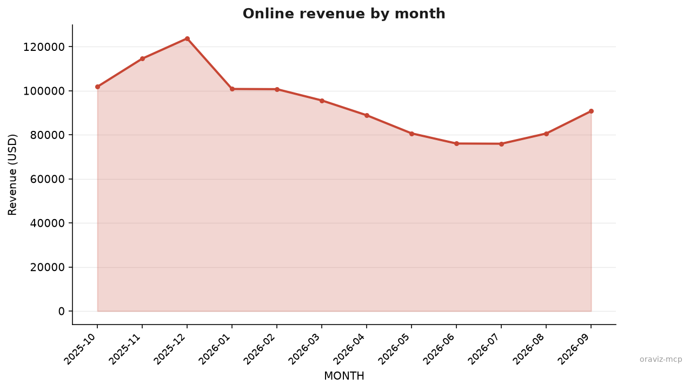

<p align="center">
  
</p>

<h1 align="center">OraViz MCP</h1>

<p align="center">
  <strong>Oracle AI Database, chart-ready.</strong> A minimal, visualization-first MCP server. Query, profile, plot.
</p>

<p align="center">
  
  
  
  <a href="LICENSE"></a>
  <a href="https://github.com/jasperan/oraviz-mcp/actions/workflows/ci.yml"></a>
</p>

---

OraViz MCP is [`pab1it0/adx-mcp-server`](https://github.com/pab1it0/adx-mcp-server) reimagined for **Oracle AI Database** -- a
deliberately tiny alternative to the broad official Oracle MCP servers. It speaks SQL, profiles tables, and turns result
sets into **PNG charts** any MCP client can show. Seven tools, read-only, no Oracle client libraries (python-oracledb
thin mode talks straight to Oracle AI Database **26ai Free** or any newer release).

Two ideas shape everything:

- **Visualization first.** The headline tool runs your query and returns an actual chart image plus a short data
  preview -- not a wall of rows.
- **Context engineering.** Agents pay for every token a tool returns, so OraViz never dumps a result set. Results are
  preview-capped, rendered as one compact markdown table with a metadata header, and large values (CLOB, BLOB, VECTOR)
  are summarised.

## Visualization at a Glance

<table>
<tr>
<td align="center"><strong>Bar</strong><br/></td>
<td align="center"><strong>Area / Line</strong><br/></td>
</tr>
<tr>
<td colspan="2" align="center"><em>Both images were rendered by <code>create_chart</code> against the demo schema in <a href="examples/demo-sales.sql"><code>examples/demo-sales.sql</code></a>.</em></td>
</tr>
</table>

## Why OraViz?

- **Charts, not query dumps** -- `create_chart` renders bar, line, area, scatter, pie, and histogram charts with an Oracle-red palette and returns the PNG as MCP image content.
- **Context-engineered results** -- bounded previews with explicit `truncated` metadata, one header per table instead of repeated JSON keys, CLOB/BLOB/VECTOR summarised, per-cell truncation.
- **Profile before you plot** -- `profile_table` returns per-column nulls, distinct counts, min/max/avg so the model can pick the right chart without fetching rows.
- **Read-only by design** -- validation admits a single `SELECT`/`WITH` statement (DDL, DML, and PL/SQL are rejected before connecting), every query is stopped by `ORACLE_CALL_TIMEOUT`, and row and cell caps apply everywhere. The guard is lexical; for a hard boundary, point OraViz at a read-only database account.
- **Minimal surface** -- 7 tools, ~600 statements of source, stdio/http/sse/streamable-http transports, structured JSON logs on stderr (stdout stays clean for stdio).
- **Zero client install** -- python-oracledb thin mode; no Oracle Instant Client, no `ORACLE_HOME`, no tnsnames.

## The Context Contract

Every row-returning tool follows the same rules, and the test suite asserts them:

| Rule | Default | Env knob |
|---|---|---|
| Query preview size (`execute_query` without `max_rows`) | 25 rows | `ORACLE_MCP_PREVIEW_ROWS` |
| Hard row cap per query (charts included) | 500 rows | `ORACLE_MCP_MAX_ROWS` |
| Longest cell before `...` truncation | 500 chars | `ORACLE_MCP_MAX_CELL_CHARS` |
| Statement timeout | 60 s | `ORACLE_CALL_TIMEOUT` |
| Metadata header per result | `<n> row(s) (truncated; more rows exist) \| columns: A, B` | -- |

A tool result therefore looks like this instead of a 25-dictionary JSON array:

```text
4 row(s) | columns: REGION, REVENUE

| REGION | REVENUE |
|---|---|
| East | 573932 |
| North | 502897 |
| South | 432190 |
| West | 360759 |
```

Weird values compress instead of exploding: `CLOB` renders as text (truncated), `BLOB` as `<binary 1234 bytes>`,
`VECTOR(384)` as `<VECTOR(384)>`, midnight timestamps as dates. When the model really needs raw rows it can pass
`max_rows` explicitly -- and the server still stops at the hard cap.

## Tools

| Tool | Returns | Context cost |
|---|---|---|
| `execute_query` | Read-only SQL result as a compact markdown table (preview-capped) | Bounded by preview cap |
| `list_tables` | Tables and views in the current (or a given) schema | One small table |
| `get_table_schema` | Columns, types, length, nullability, primary-key membership | One small table |
| `sample_table_data` | First rows of a table | `sample_size` (default 10) |
| `get_table_details` | Owner, tablespace, optimizer stats (`NUM_ROWS`, `LAST_ANALYZED`), optional exact row count | Single row |
| `profile_table` | Per-column stats: non-null, nulls, distinct, min, max, avg | ~1 line per column |
| `create_chart` | **PNG chart image** + short data preview | Image + ≤5 preview rows |

### How `create_chart` maps columns

The first column is the x-axis (or the labels for pie charts); numeric columns after it become series. That makes the
chart contract simple and SQL-driven:

```sql
SELECT region, ROUND(SUM(revenue), 2) AS revenue
FROM sales_demo
GROUP BY region
ORDER BY revenue DESC
```

```python
create_chart(sql=..., chart_type="bar", title="Revenue by region")
```

- `bar` / `line` / `area` -- label column plus one or more numeric series (up to 8 series; bar values are annotated when the chart is small)
- `scatter` -- first two numeric columns
- `pie` -- label column plus one numeric column; more than 12 slices are grouped into "Other"
- `histogram` -- the first numeric column, auto-binned

## Quick Start

### 1. Start Oracle AI Database 26ai Free

```bash
# Standalone
docker run -d --name oraviz-oracle -p 1530:1521 \
  -e ORACLE_PWD=OraViz2026 \
  container-registry.oracle.com/database/free:latest

# Or with the bundled compose file (.env needs ORACLE_PASSWORD=...)
docker compose up -d
```

The container takes a couple of minutes to initialize. `docker ps` shows `(healthy)` when it is ready.

### 2. (Optional) Load the demo schema

`examples/demo-sales.sql` creates a demo user, a 96-row `SALES_DEMO` table (12 months, 4 regions, 2 channels), and a
6-row `PRODUCT_VECTORS` table so 26ai vector columns can be inspected too. All values are deterministic.

```bash
docker exec -i oraviz-oracle sqlplus -S system/OraViz2026@//localhost:1521/FREEPDB1 <<'SQL'
CREATE USER oraviz IDENTIFIED BY "OraViz2026" DEFAULT TABLESPACE USERS QUOTA UNLIMITED ON USERS;
GRANT CONNECT, RESOURCE TO oraviz;
SQL

docker exec -i oraviz-oracle sqlplus -S oraviz/OraViz2026@//localhost:1521/FREEPDB1 \
  < examples/demo-sales.sql
```

### 3. Point your MCP client at the server

<details>
<summary><strong>Claude Desktop / Cursor</strong> (uvx from git, no clone needed)</summary>

```json
{
  "mcpServers": {
    "oraviz": {
      "command": "uvx",
      "args": ["--from", "git+https://github.com/jasperan/oraviz-mcp", "oraviz-mcp"],
      "env": {
        "ORACLE_USER": "oraviz",
        "ORACLE_PASSWORD": "OraViz2026",
        "ORACLE_DSN": "localhost:1530/FREEPDB1"
      }
    }
  }
}
```
</details>

<details>
<summary><strong>Local checkout</strong> (development)</summary>

```json
{
  "mcpServers": {
    "oraviz": {
      "command": "uv",
      "args": ["--directory", "/path/to/oraviz-mcp", "run", "oraviz-mcp"],
      "env": {
        "ORACLE_USER": "oraviz",
        "ORACLE_PASSWORD": "OraViz2026",
        "ORACLE_DSN": "localhost:1530/FREEPDB1"
      }
    }
  }
}
```
</details>

<details>
<summary><strong>Docker</strong></summary>

```bash
docker build -t oraviz-mcp .
```

```json
{
  "mcpServers": {
    "oraviz": {
      "command": "docker",
      "args": ["run", "--rm", "-i", "--network", "host",
               "-e", "ORACLE_USER", "-e", "ORACLE_PASSWORD", "-e", "ORACLE_DSN",
               "oraviz-mcp"],
      "env": {
        "ORACLE_USER": "oraviz",
        "ORACLE_PASSWORD": "OraViz2026",
        "ORACLE_DSN": "localhost:1530/FREEPDB1"
      }
    }
  }
}
```
`--network host` lets the container reach the database on the host (on Docker Desktop, `host.docker.internal`
also works). Drop both if the database is reachable on the container network.
</details>

### 4. Ask for a chart

> "Profile the SALES_DEMO table, then chart total revenue by region."

The model will call `profile_table`, pick a chart type, run `create_chart`, and you get a rendered image back.

## Configuration

| Variable | Description | Default |
|---|---|---|
| `ORACLE_USER` | Database user (**required**) | -- |
| `ORACLE_PASSWORD` | Password for the user (**required**) | -- |
| `ORACLE_HOST` | Database hostname | `localhost` |
| `ORACLE_PORT` | Listener port | `1521` |
| `ORACLE_SERVICE` | Service name | `FREEPDB1` |
| `ORACLE_DSN` | Full EZConnect descriptor; overrides host/port/service | -- |
| `ORACLE_CONFIG_DIR` | Wallet config directory (Autonomous Database / mTLS) | -- |
| `ORACLE_WALLET_LOCATION` | Wallet location | -- |
| `ORACLE_WALLET_PASSWORD` | Wallet password | -- |
| `ORACLE_MCP_PREVIEW_ROWS` | Default preview size for `execute_query` | `25` |
| `ORACLE_MCP_MAX_ROWS` | Hard row cap per query | `500` |
| `ORACLE_MCP_MAX_CELL_CHARS` | Per-cell truncation limit | `500` |
| `ORACLE_CONNECT_TIMEOUT` | TCP connect timeout, seconds | `10` |
| `ORACLE_CALL_TIMEOUT` | Per-statement timeout, seconds (`0` disables) | `60` |
| `ORACLE_MCP_SERVER_TRANSPORT` | `stdio` (default), `http`, `sse`, `streamable-http` | `stdio` |
| `ORACLE_MCP_BIND_HOST` | Bind host for network transports | `127.0.0.1` |
| `ORACLE_MCP_BIND_PORT` | Bind port for network transports | `8080` |
| `LOG_FORMAT` | `json` (default) or `console` for human-readable logs | `json` |
| `LOG_LEVEL` | structlog level number | `20` (INFO) |

Copy [`.env.template`](.env.template) to `.env` -- the server loads it via python-dotenv.

The network transports (`http`, `sse`, `streamable-http`) have no built-in authentication. Keep the default
`127.0.0.1` bind, or put an authenticating proxy in front of the port before exposing it.

## Architecture

```text
oraviz-mcp
  src/oraviz_mcp/
    server.py          # FastMCP app, config, Oracle client, validation, the 7 tools
    charts.py          # pure matplotlib rendering (bar/line/area/scatter/pie/histogram -> PNG bytes)
    main.py            # entry point: env validation, transport selection
  tests/
    test_config.py     # config dataclasses + env parsing
    test_validation.py # SQL guard, identifiers, formatting, result rendering
    test_charts.py     # every chart type + validation errors
    test_server_tools.py  # all tools against a scripted fake cursor
    test_main.py       # entry point
    integration/       # live Oracle tests (skipped without ORAVIZ_TEST_DSN)
  examples/demo-sales.sql
  docs/testing.md
```

Data flow: the MCP client calls a tool -> `server.py` validates (`validate_query` / `validate_table_name`) ->
python-oracledb thin connection -> rows are narrowed (fetch cap) -> either rendered as a compact table
(`render_rows`) or handed to `charts.py` -> the model receives text, or an image plus a short preview.

## Development

```bash
uv sync --extra dev          # install everything (matplotlib, fastmcp, oracledb, pytest)
uv run pytest                # hermetic unit suite (~98% line coverage; the 90% gate is enforced)
uv run pytest -k chart       # focus on one area

# Live integration tests against the 26ai Free container from Quick Start
ORAVIZ_TEST_DSN=localhost:1530/FREEPDB1 \
ORAVIZ_TEST_USER=oraviz \
ORAVIZ_TEST_PASSWORD=OraViz2026 \
uv run pytest tests/integration -v --no-cov

docker build -t oraviz-mcp . # container build (multi-stage, non-root)
```

See [`docs/testing.md`](docs/testing.md) and [`tests/README.md`](tests/README.md) for the testing story.

## OraViz vs. the official Oracle MCP servers

Oracle ships rich, general-purpose MCP servers -- [SQLcl's built-in MCP server](https://docs.oracle.com/en/database/oracle/sql-developer-command-line/26.2/sqcug/using-oracle-sqlcl-mcp-server.html)
(`run-sql`, `connect`, `schema-information`, ...), [ORDS MCP](https://docs.oracle.com/en/database/oracle/oracle-rest-data-services/26.2/orddg/using-ords-model-context-protocol-mcp.html),
the [OCI Database Tools MCP](https://www.oracle.com/database/tools-service/), and the reference servers in
[`oracle/mcp`](https://github.com/oracle/mcp). Use those when you need breadth: DDL, transactions, RAC, RAG pipelines.

OraViz is the opposite bet: seven tools, read-only SQL, and a hard focus on turning data into pictures without
flooding the model's context. If you want the database *operated*, use the official servers. If you want the database
*seen*, use this one.

## Benchmarks

We measured the tokens an agent must process to answer the same questions through OraViz and through the
official [SQLcl MCP server](https://docs.oracle.com/en/database/oracle/sql-developer-command-line/26.2/sqcug/using-oracle-sqlcl-mcp-server.html),
against the same 26ai Free database (`tiktoken` `cl100k_base`: tool schemas plus every tool result):

| Stage | OraViz | SQLcl MCP | Savings |
|---|---:|---:|---:|
| Tool schemas (read once per session) | 844 | 2,139 | **60.5%** |
| Schema discovery | 69 | 354 | **80.5%** |
| Full 96-row dump | 825 | 2,136 | **61.4%** |
| Whole workflow (5 questions) | 2,319 | 5,006 | **53.7%** |

The 10-row sample step trades ~55% more framing tokens than raw CSV, and that overhead cannot grow with
the result size. Rendering the aggregate as a chart costs 123 text tokens plus the PNG image. Full
methodology, step-by-step numbers, and reproduction commands: [`benchmarks/`](benchmarks/).

## Credits

- [`pab1it0/adx-mcp-server`](https://github.com/pab1it0/adx-mcp-server) -- the project this mirrors, tool for tool, for Oracle
- [Oracle AI Database 26ai Free](https://www.oracle.com/database/free/) -- the database and its container image
- [python-oracledb](https://github.com/oracle/python-oracledb) -- thin-mode driver, no client libraries required
- [FastMCP](https://github.com/jlowin/fastmcp) and the [Model Context Protocol](https://modelcontextprotocol.io)

## License

MIT -- see [LICENSE](LICENSE).

---

<div align="center">

[](https://github.com/jasperan)&nbsp;
[](https://www.linkedin.com/in/jasperan/)&nbsp;
[](https://www.oracle.com/database/free/)

</div>
